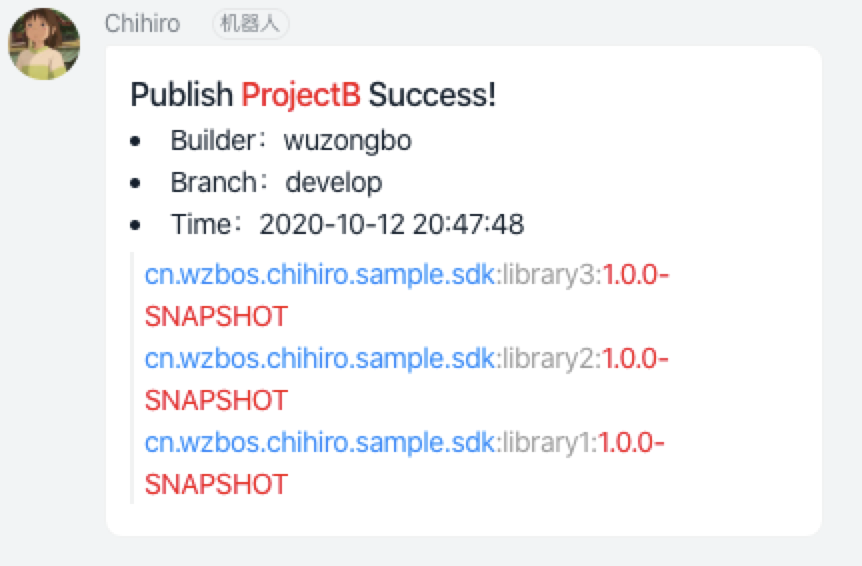

# chihiro-plugin

本插件是解决基于Sonatype Nexus Repository Manager OSS仓库 快速开发Android组件提供的一套完整的解决方案。

[](https://www.apache.org/licenses/LICENSE-2.0)
[](https://s01.oss.sonatype.org/content/repositories/releases/cn/wzbos/android/chihiro-plugin/)
[](https://s01.oss.sonatype.org/content/repositories/snapshots/cn/wzbos/android/chihiro-plugin/)

## 开发背景

在Android组件化开发中，组件一般为一个独立的Git仓库工程，使用方需要引用组件一般以远程Maven依赖方式；当组件处在开发或调试阶段的时候，可能会频繁发布版本，为了不经常修改版本号开发人员一般将版本号命名为x.x.x-SNAPSHOT版本。

**使用前：**

- 发布组件耗时
- SNAPSHOT 版本过多，占用资源
- 当多个开发人员用同一SNAPSHOT版本开发时，存在SNAPSHOT版本覆盖问题
- 使用放debug调试的时候源码经常不刷新

针对以上问题 chihiro-plugin 插件给出了解决方案，使用此插件后以上问题将不再困扰开发人员。

**使用后:**

- 组件工程直接加载到使用方工程内
- SNAPSHOT版本无需发布，直接本地依赖
- 不发布SNAPSHOT版本，所以根本不存在SNAPSHOT版本覆盖问题
- debug调式直接真正源码级调试

<p> 

</p>

## 插件功能

**1.组件开发：**

* 集成maven插件
* 支持Android Library、Java Library上传，含源码、文档
* 解决发布组件时出现unspecified版本问题，无需按顺序发布每个组件
* 组件发布结果支持企业微信通知

**2.组件调试：**

* 支持多工程加载
* 动态将单工程本地依赖转换为多工程本地依赖, project(":library1") => project(":xxx:library1")
* 动态将远程依赖转换为本地依赖, com.xxx.android:library1:1.0.0 => project(":xxx:library1")
* 自动拉取Git仓库代码

## 插件接入

示例工程: ProjectA

```
  - ProjectA
    - library1
        + src/main
        - build.gradle
        - gradle.properties
    - library2
        + src/main
        - build.gradle
        - gradle.properties
    - library3
        + src/main
        - build.gradle
        - gradle.properties
    - chihiro.gradle
    - settings.gradle
```

示例工程: ProjectB

```
  - ProjectB
    - app
        + src/main
        - build.gradle 
    - build.gradle
    - chihiro.gradle
    - settings.gradle
```

#### 1.在ProjectA/build.gradle，ProjectA/settings.gradle，ProjectB/build.gradle，ProjectB/settings.gradle中添加如下配置

```gradle
buildscript {
    repositories {
        mavenCentral()
    }
    dependencies {
        classpath "cn.wzbos.android:chihiro-plugin:1.x"
    }
}
apply plugin: 'chihiro-settings'
```

#### 2、引用chihiro插件

```
ProjectA/library1/build.gradle
ProjectA/library2/build.gradle
ProjectA/library3/build.gradle
ProjecB/app/build.gradle 
```

在以上文件内添加插件引用

```gradle
apply plugin: 'chihiro'
```

#### 3、调整依赖

```
ProjectA/library1/build.gradle
ProjectA/library2/build.gradle
ProjectA/library3/build.gradle
```

将以上文件内的project依赖改为dynamic依赖

如：

```gradle
dependencies {
    implementation project(":library2")
}
```

改为

```gradle
dependencies {
    implementation dynamic(":library2")
}
```

#### 4、配置Maven参数

在如下组件的`gradle.properties`内添加maven配置（Android Studio默认不在library内创建此文件，需要手动创建）

**ProjectA/library1/gradle.properties**

```properties
CHIHIRO_GROUP_ID=cn.wzbos.android
CHIHIRO_ARTIFACT_ID=chihiro
CHIHIRO_VERSION=1.0.0-SNAPSHOT
CHIHIRO_POM_NAME=chihiro
CHIHIRO_POM_DESCRIPTION=The compiler used in chihiro
CHIHIRO_POM_URL=https\://github.com/wzbos/chihiro
CHIHIRO_POM_INCEPTION_YEAR=2019
CHIHIRO_POM_LICENSE_NAME=The Apache Software License, Version 2.0
CHIHIRO_POM_LICENSE_URL=https\://www.apache.org/licenses/LICENSE-2.0.txt
CHIHIRO_POM_DEVELOPER_ID=wzbos
CHIHIRO_POM_DEVELOPER_NAME=wuzongbo
CHIHIRO_POM_DEVELOPER_EMAIL=sckoo@163.com
CHIHIRO_POM_SCM_CONNECTION=scm\:git\:https\://github.com/wzbos/chihiro.git
CHIHIRO_POM_SCM_DEVELOPER_CONNECTION=scm\:git\:ssh\://github.com/wzbos/chihiro.git
CHIHIRO_POM_SCM_URL=https\://github.com/wzbos/chihiro
CHIHIRO_ENABLE_JRELEASER=false
CHIHIRO_MAVEN_RELEASES_URL=https\://nexus.xxxxx.com/repository/maven-releases/
CHIHIRO_MAVEN_SNAPSHOTS_URL=https\://nexus.xxxxx.com/repository/maven-snapshots/
CHIHIRO_MAVEN_USERNAME=
CHIHIRO_MAVEN_PASSWORD=
```

library2,library3 替换 `CHIHIRO_ARTIFACT_ID`、`CHIHIRO_POM_NAME` 为library2,library3

**ProjectA/library2/gradle.properties**

```properties
CHIHIRO_POM_NAME=library2
CHIHIRO_ARTIFACT_ID=library2
# 其他省略，参考 ProjectA/library1/gradle.properties
```

**ProjectA/library3/gradle.properties**

```properties
CHIHIRO_POM_NAME=library3
CHIHIRO_ARTIFACT_ID=library3
# 其他省略，参考 ProjectA/library1/gradle.properties

```

**提示：安卓组件依赖组成如下**

```
dependencies {
  implementation "${CHIHIRO_GROUP_ID}:${CHIHIRO_ARTIFACT_ID}:${CHIHIRO_VERSION}"
}
```

**参考：library1**

```
dependencies {
  implementation "cn.wzbos.android.library:library1:1.0.0"
}
```

**请根据自身情况相应调整，`CHIHIRO_GROUP_ID`、`CHIHIRO_ARTIFACT_ID`、`CHIHIRO_VERSION` 对应以上
gradle.properties 的值
**

#### 5. 配置chihiro插件

创建ProjectB/chihiro.gradle文件 ，将以下代码拷贝进去

```gradle
chihiro {
    log = true      //打印调式日志
    maven = true    //开启Maven上传功能
    //微信机器人
    wechat {
        url "https://qyapi.weixin.qq.com/cgi-bin/webhook/send?key=微信机器人key"
    }
    //钉钉机器人
    dingtalk {
        url "https://oapi.dingtalk.com/robot/send?access_token=钉钉机器人Token"
        secret "钉钉机器人secret"
    }

    //自定义webhook，详见高级功能说明
    webhook {
        url "https://xxx.com/api"
    }

    projects = [
            "ProjectA": [
                    "directory": "../ProjectA",                 //ProjectA的相对路径
                    "debug"    : true,                          //ProjectA的加载开关
                    "git"      : "git@xxxxxxx:xxxx/xxx.git",    //ProjectA的Git仓库地址（directory文件不存在的时会自动从Git仓库拉取）
                    "branch"   : "develop"                      //ProjectA的代码分支
            ]
    ]
}
```

**参数说明**

- log: true,打印调式日志,false,不打印调式日志，默认为false
- maven: true,开启Maven上传功能，false,关闭maven上传功能，默认为false
- wechat_key: 微信机器人key，非必填
- projects: 项目集合，可为多个，非必填，Key,value 形式(key: 项目名称,value: 为具体内容)
    - debug: true 加载此项目，false（默认）不加载
    - directory: android 项目工程目录，相对路径或者绝对路径都可以，非必填，默认取当前工程同级目录
    - git: git仓库地址，非必填，格式（git@github.com:wzbos/chihiro.git 或 https://username:
      password@github.com/wzbos/chihiro.git ）
    - branch: Git分支，非必填，默认为maser

### 6、发布组件

在Terminal终端内执行如下命令

```bash
./gradlew uploadArchives
```

### 7、等待通知

微信通知样式：
<p> 

</p>


钉钉通知样式：
<p> 

</p>

## 高级功能

### 自定义触发器

通过在chihiro.gradle文件中增加如下配置即可自定义触发器

```gralde
//自定义webhook，详见高级功能说明
webhook {
    url "https://xxx.com/api"
}
```

通过此配置chihiro插件在Maven组件发布完成后以POST的方式将结果数据调用此url地址，POST内容为json格式，具体格式如下

以Demo为例：

``` json
{
	"datetime": "2020-10-23 11:01:22",
	"branch": "develop",
	"archives": [{
        "groupId": "com.example",
        "artifactId": "example-artifact",
        "version": "1.0.0",
        "pomName": "Example Project",
        "pomDescription": "This is an example project.",
        "pomUrl": "https://example.com",
        "pomInceptionYear": "2020",
        "pomLicenseName": "Apache License 2.0",
        "pomLicenseUrl": "https://www.apache.org/licenses/LICENSE-2.0",
        "pomDeveloperId": "dev123",
        "pomDeveloperName": "John Doe",
        "pomDeveloperEMail": "john.doe@example.com",
        "pomSCMConnection": "scm:git:git://example.com/repo.git",
        "pomSCMDeveloperConnection": "scm:git:ssh://example.com/repo.git",
        "pomSCMUrl": "https://example.com/repo",
        "mavenReleasesRepoUrl": "https://repo.example.com/releases",
        "mavenSnapshotsRepoUrl": "https://repo.example.com/snapshots",
        "enableJReleaser": false
    }],
	"username": "wuzongbo",
	"project": "ProjectB"
}
```